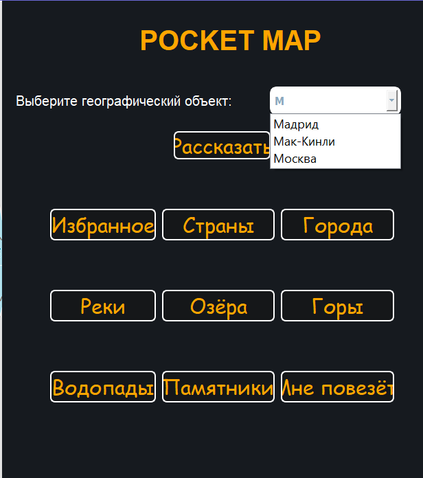

<h1 align="center">Pocket Map</h1>

##  Для чего нужно это приложение?

Это приложение может послужить заменой обычной бумажной карте по нескольким причинам, например:

* Скорость нахождения информации (в этой программе достаточно вбить имя 
нужного объекта, чтобы получить подробную информацию об этом объекте)

* Мобильность (это приложение можно открыть с любого компьютера в любое время в любом месте)

* Легкость и гибкость измененения информации

* Приложение показывает фотографию и местонахождение нужного объекта, что также улучшает качество работы

---

Пока я добавил далеко не все объекты, чтобы протестировать работу этой программы. При дальнейшей доработке можно будет добавить намного больше объектов

---

---

---

---

---

## Что нужно сделать для запуска?

1. Чтобы начать им пользоваться, надо просто запустить файл main.py, лежащий в папке application
---

* После этого на экране появится интерфейс, позволяющий просматривать различные географические объекты.
* Чтобы посмотреть объекты конкретного типа, надо выбрать этот тип (он будет написан на одной из кнопок). После этого вы увидите список доступных объектов (пока я добавил только несколько объектов).
* Затем надо нажать на объект, который вы хотите увидеть. На экране появится подробное описание этого объекта.
* В правом верхнем углу есть кружок, нажав на который, можно добавить объект в избранное.

* Также можно воспользоваться поиском и ввести название нужного объекта в поисковую строку, после чего надо 
нажать на кнопку "Рассказать".
